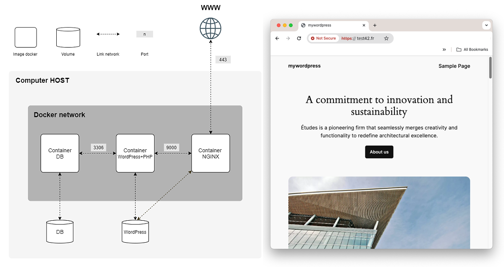

<!-- ABOUT THE PROJECT -->
## Inception

A project to deploy a WordPress website by orchestrating three Docker containers. 
As the use of Linux images is mandatory, the project involves installing and configuring Nginx for the web server, PHP for the application server, and MySQL for the database server within a single Linux container.
Through this hands-on project, we learn Docker and Docker Compose Fundamentals, Server Setup, Networking and Integration, and Security Considerations

 

